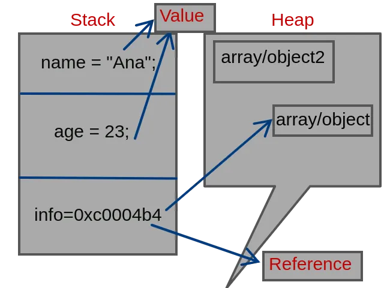

Por referencia o por valor

En la mayoría de lenguajes, los datos primitivos son inmutables. Estos tienen un tamaño fijo lo que hace que puedan ser fáciles de almacenar en memoria.

El campo number en JavaScript tiene un valor máximo de: 1.7976931348623157e+308
let maxValue = Number.MAX_VALUE;

Y un valor mínimo de: 5e-324
let minValue = Number.MIN_VALUE;

Almacenemos el valor 4, 3918 o el valor máximo, la porción de memoria que ocupa es siempre la misma.

Los datos no primitivos (objetos) son mutables y tienen un tamaño variable. Ellos necesitan ser guardados en memoria de una manera específica.
El Stack y Heap son dos áreas de la memoria donde se almacenan los datos. El Stack se utiliza para la asignación de memoria estática, mientras que el Heap se utiliza para la asignación de memoria dinámica.
La asignación de memoria estática significa que el tamaño y la ubicación de la memoria se fijan en el tiempo de compilación, mientras que la asignación de memoria dinámica significa que el tamaño y la ubicación de la memoria pueden cambiar en el tiempo de ejecución.
En JavaScript, los valores primitivos (como números, cadenas, booleanos, etc.) se almacenan en la pila, mientras que los objetos (como matrices, funciones, etc.) se almacenan en el montón.

    let textHello = "Hello World";
    let textBye = "Bye World";

    textHello = textBye;
    textBye = "Chau mundo";
    textHello = "Hola mundo";

    let person1 = {
        name: "John",
        age: 30,
        city: "New York",
        country: "USA",
        identification: {
            type: "DNI",
            number: 12345678
        }
    };

    let person2 = {
        name: "Juana",
        age: 27,
        city: "Corrientes",
        country: "Argentina",
        identification: {
            type: "DNI",
            number: 382719
        }
    };

    person1.age = 33;
    person2.age = 49;
    person1 = person2;
    person2.age = 50;

    function save(person) {
        person.identification = null;
        // Algún código para persistir en la DB
    }

    save(person2);